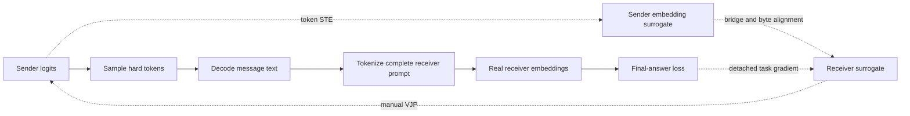

# 3T-SFT — Training Through Text

Reference implementation of **Retokenization-Aware Double Straight-Through Supervised Fine-Tuning (RADST-SFT)** for text-communicating multi-agent systems.

The public project name is 3T-SFT; RADST-SFT is the method name used in the supplied manuscript. Training uses final-answer supervision without gold intermediate messages. Agents continue to exchange ordinary hard text at inference.

Implementation is organized around UTF-8 span alignment, two straight-through estimators, directed embedding bridges, and a reverse-topological first-order gradient sweep. This repository is a new manuscript-based implementation, not an archive of the original experiments.

[中文介绍](README.zh-CN.md) · [Method](docs/method.md) · [LLM integration](docs/integration.md) · [Validation](docs/validation.md)

## Why train through text?

In a planner–solver–verifier workflow, labels often exist only for the final answer. Conventional supervised fine-tuning updates the final agent, but token sampling and decode–retokenize operations block the ordinary gradient path to earlier agents. Different tokenizers introduce another mismatch: the same message can occupy different token positions and embedding spaces.

3T-SFT preserves the hard-text forward trace and supplies a training-time surrogate across both boundaries:

1. **Token-selection STE:** hard token embeddings in the forward pass; soft expected embeddings in the backward pass.
2. **Retokenization-aware transport:** normalized UTF-8 byte overlap maps sender positions to receiver positions; directed bridges map embedding spaces.
3. **Receiver STE / manual VJP:** receiver inputs remain the embeddings of the actual retokenized text while final-answer gradients reach upstream adapters.



## Run the implementation

Use Python 3.10+ and a suitable PyTorch installation. The included CPU laboratory requires no model downloads, external datasets or API keys.

```bash
python -m pip install -e .
python -m unittest discover -s tests -v
python scripts/train_tiny.py --output outputs/tiny-radst
python scripts/train_tiny.py --mode terminal --output outputs/tiny-terminal
python scripts/infer_tiny.py --run outputs/tiny-radst --question "2+3="
```

The tiny task predicts the last decimal digit of a sum. Three frozen GRU-based agents have trainable LoRA output adapters; the middle agent can use a different tokenizer and embedding width. This is an engineering laboratory for gradient flow, not a pretrained language-model evaluation.

Each training run writes:

- `config.json` and `splits.json`: effective settings and disjoint source IDs;
- `metrics.jsonl`: loss, per-agent gradient norms and transported-gradient norms;
- `best.pt`: model parameters selected by validation loss, including the initial checkpoint as a candidate;
- `summary.json`: final held-out results from the selected checkpoint.

Checkpoints, environments and private data are not committed. Training artifacts remain under ignored `outputs/` directories.

## What is implemented

| Area | Implementation |
|---|---|
| Alignment | UTF-8 byte conversion, prompt-boundary clipping, special-token exclusion, sparse normalized overlap |
| Discrete credit path | Embedding-level token STE, receiver STE, detached-gradient manual proxy |
| Embedding spaces | Identity for explicitly shared frozen spaces; affine mapping for heterogeneous directed pairs |
| Trace training | Reverse-topological recomputation, branch accumulation, ancestor filtering, local-stabilizer isolation |
| Objectives | Final-answer masked cross-entropy, optional local cosine consistency and reference-policy KL |
| Executable workflow | Homogeneous/heterogeneous three-agent CPU example, LoRA adapters, training and ordinary-text inference |
| Evaluation | Terminal-only baseline, validation checkpoint selection, held-out split and gradient diagnostics |

The generic engine accepts a finite realized DAG, including fan-out and shared model objects across node callbacks. The included runnable workflow is a three-node chain. The reference-policy and cosine utilities are implemented and tested independently; the tiny training recipe leaves these optional stabilizers disabled.

## Source map

```text
src/three_t_sft/
  alignment.py    Sparse UTF-8 overlap and tokenizer offset conversion
  transport.py    Double STE, bridge registry, losses and manual proxy
  engine.py       Reverse-topological task-gradient transport
  tiny.py         Actual hard-text rollout and replayable tiny agents
  train.py        Optimization, validation and experiment artifacts
scripts/         Training and checkpoint inference entry points
configs/         Executable CPU experiment settings
tests/           Gradient equivalence, alignment, trace and workflow checks
docs/            Method equations, integration requirements and validation record
```

## Scope and scientific interpretation

RADST-SFT is a biased first-order surrogate. It does not differentiate through the true discrete sampling distribution or through unexecuted routing decisions. The supplied implementation checks hard-forward invariance and local gradient equivalence.

Production Qwen/Ministral adapters, benchmark manifests, paper checkpoints and large-model distributed training are not bundled. The included tiny results establish an executable training path; they are not evidence of the manuscript's benchmark gains. See the integration guide for exact-prefix replay, tokenizer offsets, dropout RNG restoration and model-adapter requirements.

The Git history records the actual development stages of this reference implementation, with separate commits for alignment, gradient transport, runnable training, and documentation/verification.
